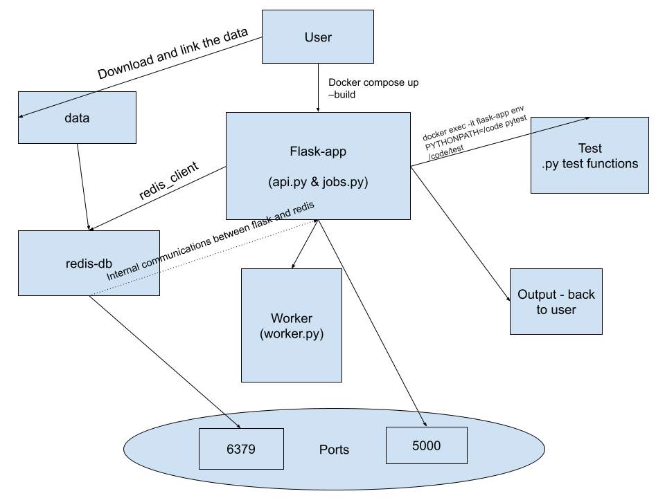

# Homeowrk08: Against the Fall of Web Apps

## This Homework Assignment contains:   

- A Python directory `src` containing three Python files:
  - `api.py`
  - `jobs.py`
  - `worker.py`
- A python directory 'test' containing three python test files:
  - `api.py`
  - `jobs.py`
  - `worker.py`
- The `Dockerfile` needed to build the image to run these containerized programs
- A `docker-compose.yml` file to automate the deployment of the Flask app, Redis database, and background worker together
- A `requirements.txt` that lists non-standard Python libraries that must be installed for this project
- A `data` directory filled with a `.gitcanary` datafile as a placeholder for data of future projects
- A `diagram.png` diagram that illustrate the more interesting or important parts of the web app


### One objective of this assignment is to use the ```src``` python directory to run the ensuing functions:    
#### From `api.py`:   

```def get_redis_client()```, ```def pull_data()```, ```def return_data()```, ```def delete()```, ```def get_all_genes()```, ```def gene_pull(hgnc_id: str)```, ```def create_job()```, def list_jobs(), ```def get_job(jobid: str)```, and ```def get_locus_types(jobid: str):```   

#### From `jobs.py`:

```def _generate_jid()```, ```def _instantiate_job(jid, status, start, end)```, ```def _save_job(jid, job_dict)```, ```def _queue_job(jid)```, ```def add_job(start, end, status="submitted")```, ```def get_job_by_id(jid)```, and ```def update_job_status(jid, status)```   

#### From `worker.py`:

```def run_worker_job_logic(job_id: str) -> None:``` & ```def do_work(job_id)```


### This can be checked using the ```test``` python directory to run the ensuing functions:   
#### From `test_api.py`:   

```def test_pull_data():```, ```def test_return_data():```, ```def test_get_genes():```, ```def test_specific_gene_format():```, ```def test_create_job():```, ```def test_job_status():```, and ```def test_get_job_result():```   

#### From `test_jobs.py`:   

```def test_generate_jid_format():```, ```def test_instantiate_job_structure():```, ```def test_save_and_get_job():```, ```def test_update_job_status():```, ```def test_add_job():```, and ```def teardown_module(module):```   

#### From `test_worker.py`:   

```def setup_mock_data(job_id: str, start: str, end: str):``` & ```def test_do_work_creates_results_and_updates_status():```


#### Purpose:
These functions are used to build our redis database, and then store, return, and later delete the data. We are to then run flask API routes to extract various data analysis regarding the gene data to provide the user with data for their given hgnc_id request. Finally, the api.py scripts are meant to call upon the jobs.py and worker.py scripts to create an asynchronous job queue system, where user submitted jobs are queued and then processed in the background by a worker, while being tracked through Redis.

Additionally, the goal is for the functions: ```def pull_data()```, ```def return_data()```, ```def delete()```, ```def get_all_genes()```, ```def gene_pull(hgnc_id: str)```, ```def create_job()```, ```def list_jobs()```, and ```def get_job(jobid: str)```; to set up Flask API routes with ```@app.route``` to then call upon these funtcions using curl commands to run from the server for various endpoints, with the data in the redis database.   

Finally we run integration and unit tests using the `test` directory to ensure the smooth programming processes are working as expected.
## Routes
The following route endpoints correlate to the following functions:   

```@app.route('/data', methods = ['POST'])``` is used to run ```def pull_data()```

```@app.route('/data', methods = ['GET'])``` is used to run ```def return_data()```

```@app.route('data', methods=['DELETE'])``` is used to run ```def delete()```

```@app.route('/genes', methods=['GET'])``` is used to run  ```def get_all_genes()```   

```@app.route('/genes/<hgnc_id>', methods=['GET'])``` is used to run ```def gene_pull(hgnc_id: str)```   

```@app.route('/jobs', methods=['POST'])``` is used to run ```def create_job()```   

```@app.route('/jobs', methods=['GET'])``` is used to run ```def list_jobs()```  

```@app.route('/jobs/<jobid>', methods=['GET'])``` is used to run ```def get_job(jobid: str)```   

```@app.route('/results/<jobid>', methods=['GET'])``` is used to run ```def get_locus_types(jobid: str)```   


#### Additionally, in Worker.py

The HotQueue ```@q.worker``` decorator is used to watch the queue and pull off Job IDs as they arrive.


## Data
The data this projet is analyzing is the complete list of every named gene. The Human Genome Organization has named every genome with a meaningul name. This dataset includes all of those genomes, where they are, what ehy're named, symbols for the genome,  various Id's and other descriptors. Used here in json format this data is comprehensive and crucial to understanding human genomes. Having this public database is crucial, and these functions help users to identify and search for individual genomes.

The data can be accessed through the HGNC archive at the following link:(https://www.genenames.org/download/archive/)

Where the user can then download the specific json data used in this project here:(https://storage.googleapis.com/public-download-files/hgnc/json/json/hgnc_complete_set.json)

It is then built into the redis database using the ```def pull_data()``` and ```def get_redis_client()``` functions with the downloaded URL being set above:    
```rd = get_redis_client()   

rd = get_redis_client()   
HGNC_URL = "https://storage.googleapis.com/public-download-files/hgnc/json/json/hgnc_complete_set.json"
```   
 
The ```pull_data()``` function fetches the dataset and stores it in Redis for access by all route

## Deploying the App from docker Compose
A container for this code can be made with the following docker commands using the file and contents of: ```docker-compose.yml```   

within your desired directory run: ```docker-compose up --build``` This will start the container, as well as build it in the default driver.   

you can check that both your flask API and redis database are setup using ```docker ps``` to output what is currently running   

To run pytest please executing the following:   

`docker exec -it flask-app env PYTHONPATH=/code pytest /code/test`


### Running as a Flask App:
The line ```app = Flask(__name__)``` allows the file to turn into a Flask API server. From there the user should open a second terminal window and naviaget back to the same folder that holds these python scripts and where the generated flask api server is currently running. Then, the user can run the following structure to call upon the routes that were written in the api.py file in the localhost and default port = 5000: ```curl -X GET "http://127.0.0.1:5000/data"``` where, ```127.0.0.1:5000``` is generated from the ```* running on ...``` line in the terminal window in which the Flask API is running.  

/data can be replaced with any of the endpoints given below depending on the desired function   

### Parameters

To make these queue based job requests it is important that the user provides specific parameters to conduct analysis over datapoints to their specifications. For this dataset, that means giving a range of gene approval dates that the user would like to analyze the results of.

For example, if a user wants to request every gene that was approved between February 2nd 2010 and March 20th 2015

they would use:   

```curl -X POST "http://127.0.0.1:5000/jobs" \ -H "Content-Type: application/json" \ -d '{"start_date": "2010-02-10", "end_date": "2015-03-20"}'```   

and it would request the gene data that was approved between those two dates.

Furthermore, for the given curl command:   

```curl -X GET http://127.0.0.1:5000/results/82916f6d-af42-42b5-bd18-07fc762fc48f```   

the user will take the previous filter job command by start and end dates in which the gene data was approved, and conduct a counting analysis to determine the number of locus_types present within that timeframe.

### Output  
The output will be the analysis of the downloaded data from our functions.   

This will include:   
- ```curl -X POST "http://127.0.0.1:5000/data"``` - this will output a message on if the data was stored correctly   

    example code output:  
    ```json
    {
      "message": "HGNC data loaded successfully"
    }
    ```

- ```curl -X GET "http://127.0.0.1:5000/data"``` - this will ouput the entire dataset that has been stored in redis

    example code snippet output:  
    ```json
    {
      "agr": "HGNC:54219",
      "date_approved_reserved": "2019-04-09",
      "date_modified": "2019-04-09",
      "ensembl_gene_id": "ENSG00000246523",
      "entrez_id": "100506368",
      "gene_group": [
        "Divergent transcripts"
      ]
    }
    ```

- ```curl -X DELETE "http://127.0.0.1:5000/data"``` - this will output nothing, and the redis database will be cleared of data by deleting it   

- ```curl -X GET "http://127.0.0.1:5000/genes"``` - this will output all the HGNC gene id's within the dataset

    example code snippet output:  
    ```json
    {
      "HGNC:3443",
      "HGNC:3444",
      "HGNC:26727",
      "HGNC:53894"
    }
    ```

- ```curl -X GET "http://127.0.0.1:5000/genes/53894"``` - this will output description and other information regarding a specific HGNC gene id

    example code snippet output:  
    ```json
    {
      "agr": "HGNC:53894",
      "alias_symbol": [
        "erfl1"
      ],
      "ccds_id": [
        "CCDS92627"
      ]
    }
    ```

- ```curl -X POST http://127.0.0.1:5000/jobs \ -H "Content-Type: application/json" \ -d '{"start_date": "2010-02-10", "end_date": "2015-03-20"}'``` - this will create a job submission request within a given list of specified gene approval dates that the user submits.
 
    example code output:  
    ```json
    {
      "job_id": "82916f6d-af42-42b5-bd18-07fc762fc48f",
      "status": "submitted"
    }
    ```

- ```curl -X GET "http://127.0.0.1:5000/jobs" \ -H "Content-Type: application/json" \ -d '{"start_date": "2010-02-10", "end_date": "2015-03-20"}'``` - this will return all the current jobs that have been submitted by the user.
  
    example code output:  
    ```json
    {
      "jobs": [
        "fbe83c5c-bad4-4b85-a9c3-d1a8bb45e83b"
      ]
    }
    ```

- ```curl -X GET http://127.0.0.1:5000/jobs/82916f6d-af42-42b5-bd18-07fc762fc48f``` - this will return the status of a specified job request as: submitted, in progress, or complete   

    example code output:  
    ```json
    {
      "end": "2015-03-20",
      "id": "82916f6d-af42-42b5-bd18-07fc762fc48f",
      "start": "2010-02-10",
      "status": "complete"
    }
    ```
- ```curl -X GET http://127.0.0.1:5000/results/82916f6d-af42-42b5-bd18-07fc762fc48f``` - this will return the status of a specified job request as: submitted, in progress, or complete   

    example code output:  
    ```json
    {
  "end_date": "2020-01-01",
  "job_id": "7da3281d-d106-43e2-a54f-de68ebe3b5a7",
  "locus_type_counts": {
    "RNA, cluster": 114,
    "RNA, long non-coding": 4146,
    "RNA, micro": 1707,
    "RNA, misc": 27,
    "RNA, ribosomal": 58,
    "RNA, small nuclear": 34,
    "RNA, small nucleolar": 484,
    "RNA, transfer": 533,
    "RNA, vault": 1,
    "T cell receptor pseudogene": 1,
    "complex locus constituent": 1,
    "endogenous retrovirus": 103,
    "gene with protein product": 4718,
    "immunoglobulin gene": 5,
    "immunoglobulin pseudogene": 8,
    "pseudogene": 11176,
    "readthrough": 132,
    "region": 1,
    "unknown": 22
  },
  "start_date": "2005-01-01",
  "total_genes_counted": 23271
  }
    ```


## Diagram

A diagram of the process described is seen here:



## Chatgpt acknowledgment
Chatgpt was used to assist in this code primarily in the genes script to ensure consistency in data structure;   

it was also used to help build the ```test_worker.py``` functions to ensure that the error test cases were being read properly


it was also used to help throughout with some of the redis formatting (indentations and structure);   

finally it was used to build part of the ```def create_job():``` function to help build and verify the date times for the range indicator. This was done because I wanted to ensure the correct format.


